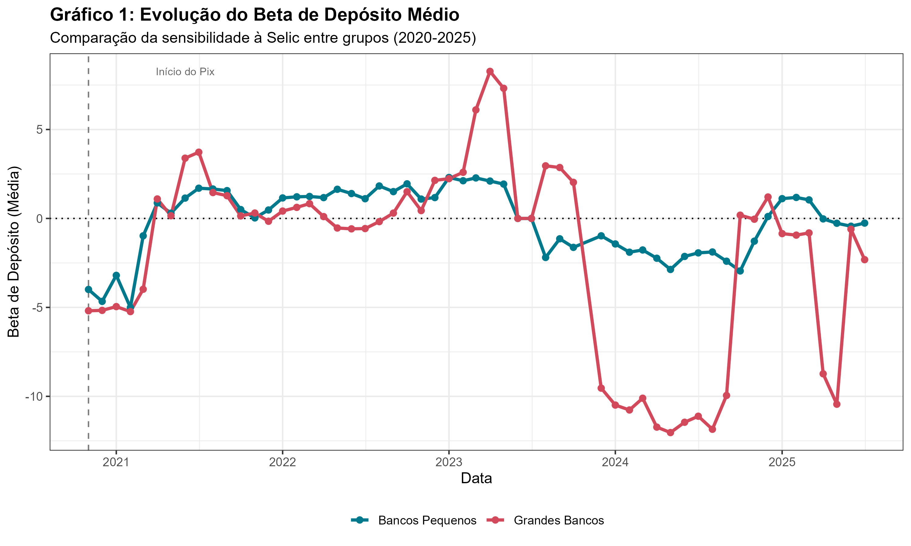
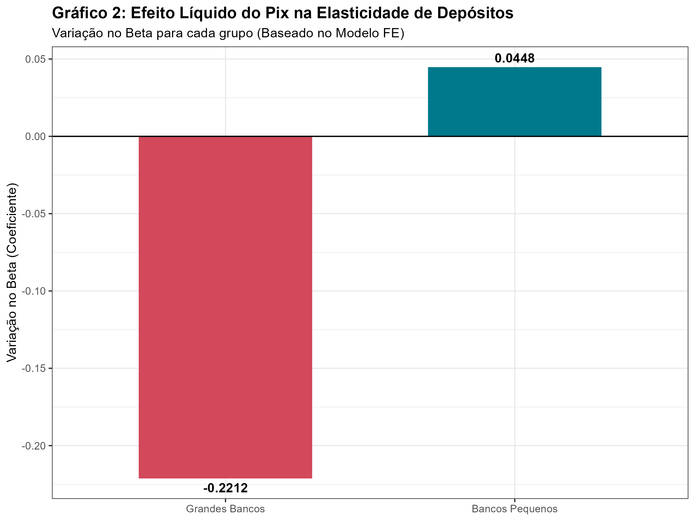

# O Impacto do Pix na Competição Bancária: Uma Análise via Betas de Depósito


> **Repositório oficial do código fonte do Trabalho de Conclusão de Curso (TCC) em Ciências Econômicas.**

Este projeto investiga econometricamente se a introdução do **Pix** (sistema de pagamentos instantâneos do Banco Central do Brasil) alterou a estrutura de mercado bancário, reduzindo a vantagem competitiva dos grandes bancos ("vantagem da conveniência") e aumentando a elasticidade dos depósitos em relação à taxa Selic.

---

## 📊 Sobre o Estudo

A literatura econômica recente (Drechsler, Savov & Schnabl, 2017; Sarkisyan, 2025) sugere que o poder de mercado dos bancos pode ser medido pela sensibilidade dos seus depósitos às variações da taxa de juros básica (**Deposit Beta**).

Neste estudo, testamos a hipótese de que o Pix funcionou como um choque tecnológico que reduziu os custos de transação e a "fricção" de mudança bancária, forçando os bancos a competirem mais agressivamente por depósitos.

### Principais Resultados
* **Aumento da Elasticidade:** Observou-se que, após o Pix, a sensibilidade dos depósitos à Selic aumentou nos grandes bancos.
* **Ganho Relativo dos Pequenos:** Bancos menores, que historicamente já pagavam taxas mais altas, sofreram menos com a fuga de depósitos relativa, indicando um "nivelamento" do campo de jogo competitivo.

---

## 🛠 Metodologia e Abordagem Técnica

O estudo foi conduzido inteiramente em **R**, utilizando uma abordagem de **Estimação em Dois Estágios**, seguindo estritamente a metodologia de Sarkisyan (2025):

1.  **Estágio 1 (Cálculo dos Betas de Fluxo):**
    * Agregação dos depósitos ao nível do **Banco** (soma de todas as agências/municípios).
    * Cálculo de **Semi-elasticidade** ($\Delta \ln(Q) \sim \Delta i$) através de regressões em **Janelas Móveis (Rolling Windows)** de 10 meses.
    * Controle para períodos de estabilidade da Selic (Platôs).

2.  **Estágio 2 (Modelo de Painel):**
    * Regressão com **Efeitos Fixos (Two-Way Fixed Effects)** para controlar características não observadas de banco e choques de tempo.
    * Identificação do efeito via interação: $Beta_{it} \sim Pix_{mt} \times SmallBank_i$.

---

## 📂 Estrutura do Repositório

O código foi modularizado para garantir reprodutibilidade e organização ("Separation of Concerns").

| Script | Função | Descrição Técnica |
| :--- | :--- | :--- |
| `01_etl_estban.R` | **ETL** | Leitura e limpeza dos dados brutos do BACEN (ESTBAN). Padronização de CNPJs e Municípios. |
| `02_calc_hhi.R` | **Feature Eng.** | Cálculo de Market Shares e Índice Herfindahl-Hirschman (HHI) por município/mês. |
| `03_calc_betas.R` | **Estágio 1** | Estimação dos *Flow Betas* (Janela Móvel de 10 meses) agregados por CNPJ. |
| `04_merge.R` | **Data Prep** | Consolidação das bases (Microdados + Macroeconomia + Pix + Municípios). |
| `05_modelagem.R` | **Estágio 2** | Estimação do modelo econométrico principal (`fixest`) e testes de robustez. |
| `06_plots_tabs.R` | **Reporte** | Geração automática dos gráficos e tabelas (pacotes `ggplot2`, `gt`, `modelsummary`). |

---

## 🚀 Como Reproduzir

### Pré-requisitos
Certifique-se de ter o **R** e o **RStudio** instalados.

### Passo a Passo

1.  **Clone o repositório:**
    ```bash
    git clone [https://github.com/SEU-USUARIO/tcc-pix-econometria.git](https://github.com/SEU-USUARIO/tcc-pix-econometria.git)
    ```
2.  **Abra o Projeto:**
    Clique duas vezes no arquivo `TCC_Pix.Rproj` para abrir o RStudio no diretório correto.

3.  **Instale as Dependências:**
    Para configurar o ambiente automaticamente, abra o projeto no RStudio e execute o script de configuração:

    1. Abra o arquivo `setup.R`.
    2. Clique no botão **Source** (ou pressione `Ctrl + Shift + Enter`).

Isso instalará e carregará todos os pacotes necessários (como `fixest`, `tidyverse`, `modelsummary`) e garantirá que as pastas do projeto estejam criadas.

4.  **Dados Brutos:**
    * Devido ao tamanho, os arquivos `.csv` do ESTBAN não estão no GitHub.
    * Baixe os dados mensais do [IF.data / Bacen](https://www.bcb.gov.br/) para os anos de 2018 a 2025.
    * Coloque-os na pasta `data/raw/estban/`.

5.  **Execute os Scripts:**
    Rode os scripts na ordem numérica (01 a 06).

---

## 📈 Visualização dos Resultados

*(Exemplos dos outputs gerados pelo script 06)*

### Evolução dos Betas (Grandes vs. Pequenos)

*O gráfico demonstra a mudança estrutural na sensibilidade à taxa de juros após a introdução do Pix.*

### Efeito Líquido (Coeficientes)

*Comparação do efeito marginal do Pix na elasticidade de depósitos.*

---

## 📚 Referências Principais

* **Drechsler, I., Savov, A., & Schnabl, P.** (2017). *The Deposits Channel of Monetary Policy*. The Quarterly Journal of Economics.
* **Sarkisyan, S.** (2025). *Instant Payment Systems and Competition for Deposits*. Working Paper.

---

**Autores:**
* [Seu Nome]
* [Nome do Colega 1]
* [Nome do Colega 2]

*Orientador: Prof. [Nome do Orientador]*